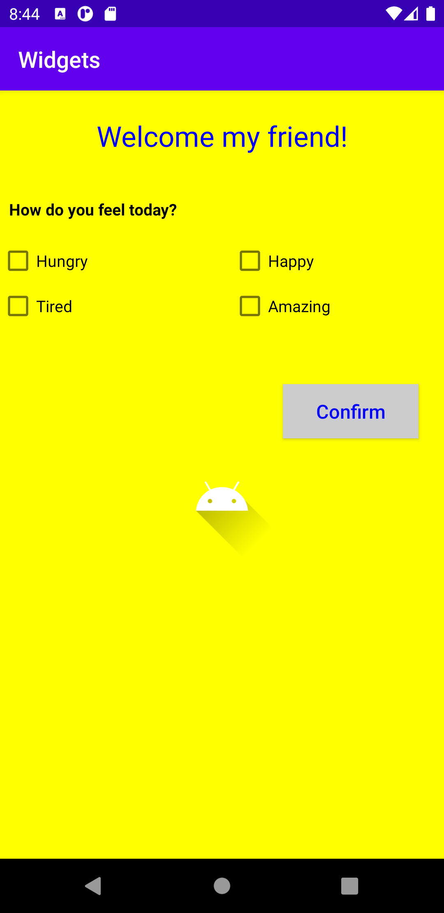
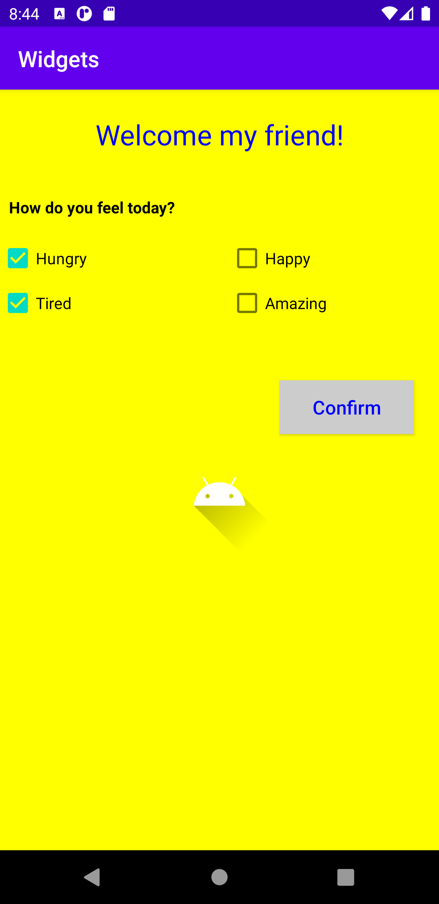
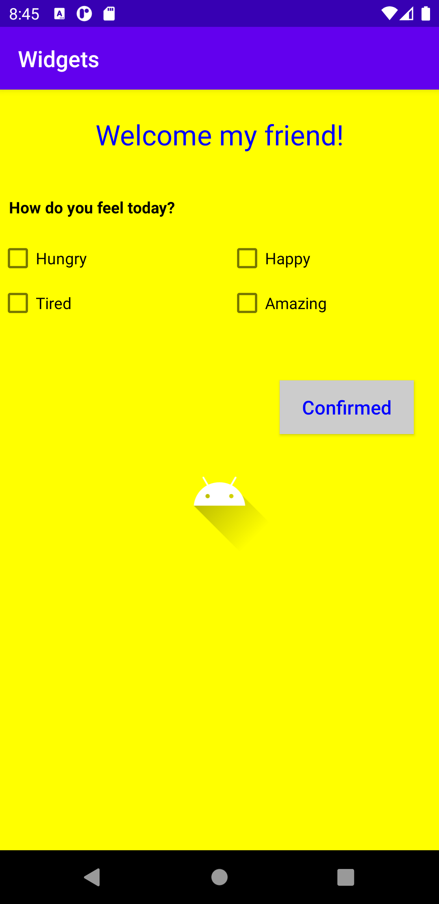

# Rapport för widgets

## Appview

Appen är skapad med en linearlayout med en vertical riktning på elementen som vi kan se i koden
nedan. För varje element som implementeras innanför linearlayout-taggen så skapas det en ny rad.
Vi ser också i Figur 1 att det finns checkboxar som ligger sidanom varandra trotts att varje nytt element ska
skapas på en ny rad. Detta är möjligt då det ligger en ny linearlayout inne i den befintliga som
har en horizontal riktning och då gör att elementen som implementeras i den hamnar till höger om
det första elementet istället för att hamna under varandra.

```
<LinearLayout xmlns:android="http://schemas.android.com/apk/res/android"
    xmlns:app="http://schemas.android.com/apk/res-auto"
    xmlns:tools="http://schemas.android.com/tools"
    android:orientation="vertical"
    android:layout_width="match_parent"
    android:layout_height="match_parent"
    android:background="#ffff00"
    tools:context=".MainActivity">
```


*Figur 1. Appens utseende*

Som vi även kan se i Figur 1 så används en textview, checkbox, button och imageview. I koden nedan
ser vi först en textview vilket innehåller vanlig text som är stylad till att vara i centrum och
framstå som en rubrik. Sedan har vi en checkbox med tillhörande text som användaren kan kryssa i
om så önskas. En button är implementerad så det som användaren har markerat i checkboxarna skickas
då som svar och texten ändras på knappen från Confirm till Confirmed. Hur det ser ut kan vi först
se i Figur 2 under koden där användaren kryssar i svaren som sedan skickas in i Figur 3 med hjälp
av knappen. Sist i koden har vi en imageview där en bild är implementerad. Bilden är centrerad
och ligger sist i linearlayouten som avslutas efter imageviewn då det ej finns fler element som ska
implementeras.

```
<TextView
        android:id="@+id/textView"
        android:layout_width="match_parent"
        android:layout_height="50dp"
        android:gravity="center"
        android:layout_marginBottom="30dp"
        android:textSize="25sp"
        android:textColor="#0000ff"
        android:layout_marginTop="15dp"
        android:text="Welcome my friend!" />

<CheckBox
            android:id="@+id/checkBox1"
            android:layout_width="205dp"
            android:layout_height="wrap_content"
            android:text="Hungry" />

<Button
        android:id="@+id/button"
        android:layout_width="120dp"
        android:layout_height="wrap_content"
        android:layout_marginLeft="250dp"
        android:layout_marginStart="250dp"
        android:layout_marginTop="25dp"
        android:background="#ccc"
        android:text="Confirm"
        android:textAllCaps="false"
        android:textColor="#0000ff"
        android:textSize="17sp" />

<ImageView
        android:id="@+id/imageView"
        android:layout_width="match_parent"
        android:layout_height="wrap_content"
        app:srcCompat="@drawable/ic_launcher_foreground"
        tools:ignore="VectorDrawableCompat" />
```


*Figur 2. Checkboxar markerade*


*Figur 3. Texten på knappen har ändrats*